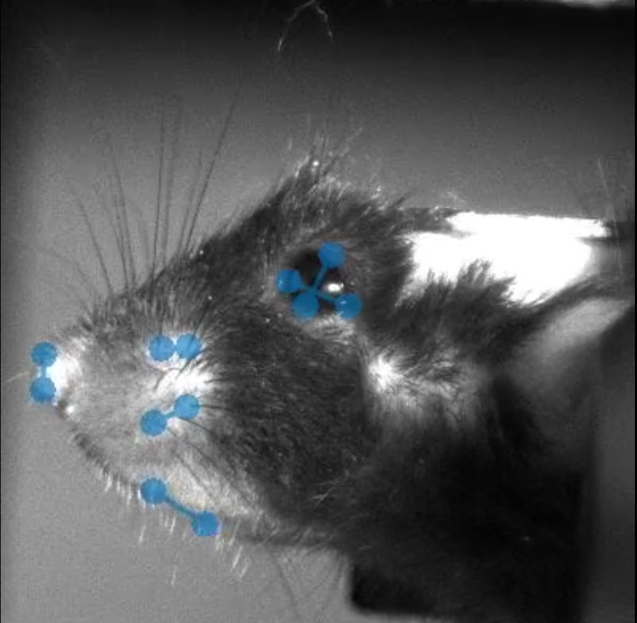
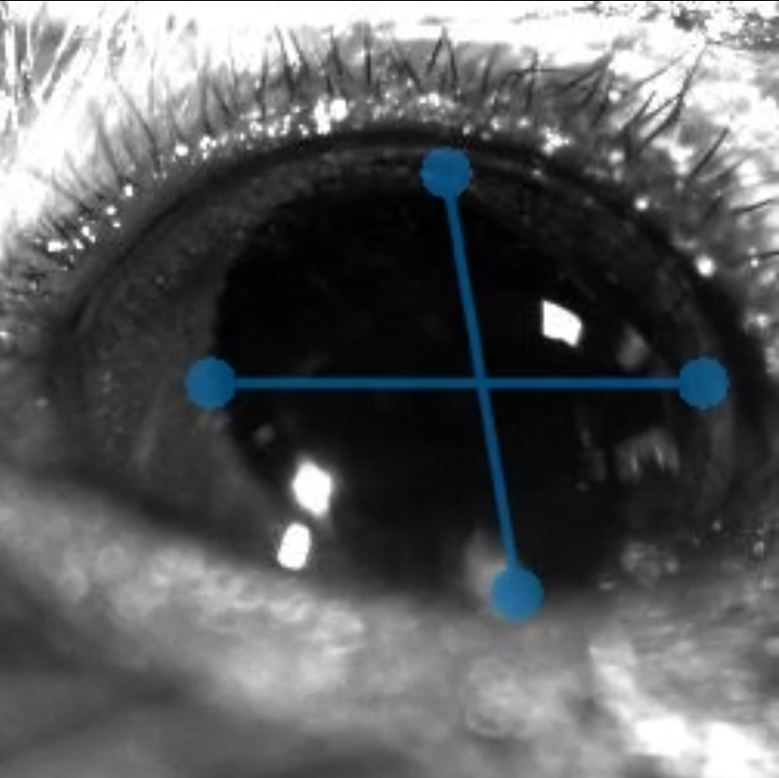

# sleapGUI

## SLEAP Installation
Create workflows for foundational SLEAP commands.

1. Install [SLEAP](https://legacy.sleap.ai/installation.html) using [Miniconda](https://www.anaconda.com/docs/getting-started/miniconda/main): 

Windows/Linux (NVIDIA GPU Required for Fast Video Analysis):

<pre>
<code>conda create -y -n sleap -c conda-forge -c nvidia -c sleap/label/dev -c sleap -c anaconda sleap=1.4.1</code>
</pre>

Mac:

<pre>
<code>conda create -y -n sleap -c conda-forge -c anaconda -c sleap sleap=1.4.1</code>
</pre>

## sleapGUI Installation
This application uses the same Qt bindings as SLEAP, through the QtPy compatibility layer, i.e. must be run in the SLEAP conda environment.

1. Activate the SLEAP environment:

<pre>
<code>conda activate sleap</code>
</pre>

- Make sure that [Git](https://git-scm.com/downloads) is downloaded to your computer.
- After dowloading Git, in Anaconda path to the directory which has Git/cmd
  - Ex: "C:\Users\OZDEMIK2\AppData\Local\Programs\Git\cmd"
  - type "git --version" to confirm the Git Version
  - Activate sleap and dowload the sleapGUI in this location

2. Install sleapGUI:
<pre>
<code>pip install --no-deps git+https://github.com/khicken/sleapGUI.git</code>
</pre>
<button onclick="navigator.clipboard.writeText('pip install --no-deps git+https://github.com/khicken/sleapGUI.git')"></button>

_Note: if updating, run after activating the SLEAP enviornment:_
<pre>
<code>pip uninstall -y sleapgui</code>
</pre>
<button onclick="navigator.clipboard.writeText('pip uninstall -y sleapgui')"></button>

_Then rerun command 2_

## Usage

Simply run:

<pre>
<code>sleapgui</code>
</pre>
<button onclick="navigator.clipboard.writeText('sleapgui')"></button>

There are currently three types of analysis: <code>face</code>, <code>face social</code>, and <code>pupil</code>.

<ul>
  <li><code>face</code> uses 12 pose estimation points: 4 for the Eyelids, 2 for the Nose, 2 for the Mouth, and 4 for the Whiskers. 
    
  </li>
  <li><code>face social</code> uses 18 pose estimation points for social interaction tracking. 6 from the right animal (4 whiskers, and 2 nose), and 12 from the left animal (same as in the sleapgui face)</li>
  

  <li><code>pupil</code> uses 4 pose estimation points: Top, Bottom, Right, and Left. 
    
  </li>
</ul>

The default analysis is for <code>face</code>. To explicitly use face analysis (12 nodes), run:

<pre>
<code>sleapgui face </code>
</pre>
<button onclick="navigator.clipboard.writeText('sleapgui face')"></button>

For face social analysis (18 nodes), run:

<pre>
<code>sleapgui face social</code>
</pre>
<button onclick="navigator.clipboard.writeText('sleapgui face social')"></button>

For pupil analysi (4 nodes), run:

<pre>
<code>sleapgui pupil</code>
</pre>
<button onclick="navigator.clipboard.writeText('sleapgui pupil')"></button>

## Compatibility
| Platform | Python Version | SLEAP Version |
|----------|----------------|---------------|
| Windows  | 3.7 | 1.4.1 |
| MacOS  | 3.7 | 1.4.1 |
| Linux  | 3.7 | 1.4.1 |

## Contributing
Contributions are welcome! Please open an issue or submit a pull request.

## License
This project is licensed under the MIT License. See the LICENSE file for details.
